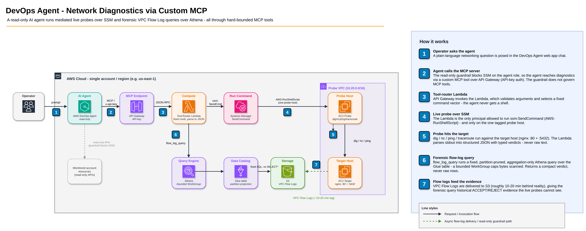

# DevOps Agent - Network Diagnostics via Custom MCP

A deployable demo where **AWS DevOps Agent** autonomously troubleshoots VPC networking
problems (DNS, reachability, port blocks) by calling a **custom MCP server** that runs
`dig` / `nc` / `ping` / `traceroute` on an EC2 probe host via **SSM** - and returns
**structured** findings the agent reasons over and chains.

It has two complementary halves:

- **Live active probes** (`resolve_dns`, `tcp_reachability`, `ping_host`, `traceroute_host`) -
  authoritative for problems happening *right now*.
- **Historical / forensic evidence** (`flow_log_query`) - queries **VPC Flow Logs** via Athena
  to answer "was traffic ACCEPTed or REJECTed over a *past* window, from whom, on which port,
  since when" - the only way to investigate an already-resolved or intermittent incident that
  the live probes are blind to.

A generic **DevOps Agent Skill** teaches the agent *how* to investigate - which half to reach
for (live vs forensic) and how to read the verdicts.

## Why this exists

DevOps Agent is **read-only by design**. Its permission guardrail blocks `ssm:SendCommand`
even if you grant it on the investigation role, so you cannot simply let the agent run
network probes. The AWS-sanctioned path is a **custom MCP server**: the guardrail does not
govern MCP tools. A tool-router Lambda holds the SSM permission and mediates a FIXED command
set, returning structured JSON.

## Architecture



The agent reaches diagnostics through the **custom MCP server** (the read-only guardrail blocks
`ssm:SendCommand` on the agent role, but it does not govern MCP tools). The tool-router Lambda holds
the SSM permission and runs a FIXED command set on the single tagged probe host, parsing raw stdout
into structured JSON. For `flow_log_query`, the same Lambda runs a FIXED, partition-pruned,
aggregation-only Athena query over the VPC Flow Logs (Glue table on S3) inside a bytes-scanned-capped
WorkGroup, and returns a compact verdict - never raw rows.

Four stacks (all in one account / region, e.g. `us-east-1`):

| Stack | Contents |
|-------|----------|
| `NetDiagProbeStack` | VPC, probe host (tools), target host (nginx :80/:5432), Route53 private zone `db.corp.internal` |
| `NetDiagFlowLogsStack` | VPC Flow Log (custom format) -> S3, Glue db/table with **partition projection**, Athena results bucket + WorkGroup (bytes-scanned cap) |
| `NetDiagMcpStack` | API Gateway + API key + tool-router Lambda (SSM-scoped to the probe host; Athena/Glue/S3-scoped to the flow-logs surface) |
| `NetDiagAgentStack` | Agent space, agent role (read-only), operator app role, monitor association |

### Tools the agent gets (read-only, allow-listed)

**Live probes** (run a command on the probe host via SSM):

| Tool | Runs | Returns |
|------|------|---------|
| `resolve_dns` | `dig` | dns_status, resolved_ip, records, resolver, query_ms |
| `tcp_reachability` | `nc -zv` | verdict OPEN / CONNECTION_REFUSED / CONNECTION_TIMEOUT + remediation hint |
| `ping_host` | `ping -c4` | reachable, loss_pct, rtt_avg_ms, verdict |
| `traceroute_host` | `traceroute -I` | per-hop list, last_responding_hop |

**Historical / forensic** (query VPC Flow Logs via Athena):

| Tool | Runs | Returns |
|------|------|---------|
| `flow_log_query` | Fixed, partition-pruned Athena aggregation over VPC Flow Logs | verdict PERSISTENT_REJECT / INTERMITTENT / ALL_ACCEPT / NO_DATA, accept/reject counts, first/last_reject timestamps, top_peers, top_ports |

`flow_log_query` is flexible across dimensions - filter by any combination of:

- `ip` + `direction` - pin an endpoint. `direction:"to"` (default) = `ip` is the destination
  (who connects **to** it); `direction:"from"` = `ip` is the source (where it connects **to**).
  Resolve a hostname to an IP with `resolve_dns` first - flow logs record IPs, not names.
- `port` - destination port (omit for **all ports**; useful for port discovery).
- `protocol` - `TCP` / `UDP` / `ICMP` (omit for all).
- `action` - `ACCEPT` / `REJECT` / `ALL`.
- `window_minutes` - look-back window from now (default 60, max 180), **or**
- `start_time` / `end_time` - an explicit incident window (ISO-8601 or epoch) to bracket exactly
  the range a client reported - this yields a clean verdict for the incident instead of blending
  it with surrounding healthy traffic. The result echoes the actual `window_start`/`window_end`.

At least one of `ip` / `port` / `protocol` is required so every query stays focused (and cheap).
The query shape is always `GROUP BY ... LIMIT` with a date-partition filter - the Lambda physically
cannot emit `SELECT *` or an unbounded scan, and the WorkGroup enforces a hard bytes-scanned cap.

## Notes (what is real vs simulated)

- **Real:** every probe is a genuine command executed on a real EC2 host against a real
  target; the packets, timeouts, and RTTs are real. The fault (`seed.sh`) is a real security
  group rule removal - port 5432 is genuinely dropped, not mocked.
- **Mediated & safe:** the agent never gets a shell. Each tool runs a FIXED command vector;
  the only agent-controlled values are a validated hostname and port (injection is rejected
  before any SSM call). The Lambda is the only principal that can call `ssm:SendCommand`, and
  only `AWS-RunShellScript` on the single tagged probe instance.
- **Structured by construction:** the agent never sees raw stdout - only the JSON the Lambda's
  per-command parsers produce (stable `finding_id`, typed verdicts), so its reasoning is
  deterministic and composable.
- **Flow logs are real and forensic:** `flow_log_query` reads genuine VPC Flow Log records
  delivered to S3. They **lag reality by ~10-20 minutes** (aggregation + delivery), so a
  brand-new fault can read `NO_DATA` until records land - this is expected, and it is exactly
  why flow logs *complement* rather than replace the live probes. The demo runs 1-minute
  aggregation for a snappy loop; a production VPC typically runs 10-minute. Because the target
  has a public IP, flow logs also capture internet scanners hitting it - the tool's `top_peers`
  breakdown separates the legitimate private source from that public noise.

## Prerequisites

Tested on macOS and Linux (the `scripts/` are bash and use `aws` + `jq`; on Windows use WSL).

| Tool | Version |
|------|---------|
| AWS CLI | >= 2.35.9 (`aws devops-agent` subcommand required; upgrade with the [official installer](https://docs.aws.amazon.com/cli/latest/userguide/getting-started-install.html) if `aws --version` is older or `aws devops-agent help` fails) |
| Node.js | >= 20 |
| AWS CDK | v2 (`npm i -g aws-cdk`, >= 2.140) |
| Python | 3.12 |
| Docker | any recent (for `sam build --use-container`) |
| AWS SAM CLI | >= 1.100 |
| jq | any recent |

- An AWS account + a named AWS CLI profile with credentials for it. Set the profile per run
  with `PROFILE=<your-profile>` (the scripts assert the profile resolves to the expected account
  before mutating anything).
- Copy `.env.example` to `.env` and set the target account/region:
  ```bash
  cp .env.example .env
  # then edit CDK_PROCESSING_ACCOUNT / CDK_PROCESSING_REGION
  ```
- Install project dependencies (required once after cloning):
  ```bash
  npm install
  ```
- Bootstrap CDK in your target account/region (required once per account/region, before first deploy):
  ```bash
  source .env
  cdk bootstrap aws://${CDK_PROCESSING_ACCOUNT}/${CDK_PROCESSING_REGION} --profile <your-profile>
  ```

## Cost

This deploys **billable** infrastructure. Running the demo for roughly an hour in `us-east-1`
is on the order of a few US$; leaving it running costs a few US$/day, dominated by the two
EC2 hosts and the NAT-free VPC. Rough on-demand estimate (verify with the AWS Pricing Calculator
for your region):

| Resource | Rough cost |
|----------|-----------|
| 2x EC2 `t3.micro` (probe + target) | ~$0.02/hr (~$15/mo) |
| VPC, subnets, Route53 private zone | negligible (no NAT gateway) |
| API Gateway + Lambda | pay-per-use; negligible at demo volume |
| S3 (flow logs) + Glue + Athena | pennies; Athena billed per TB scanned, bounded by a WorkGroup bytes-scanned cap |
| VPC Flow Logs delivery | per-GB; negligible at demo volume |

**Charges accrue until you tear down** — run `scripts/teardown.sh` when finished (see below).

## Run it

Every script requires `PROFILE` — the AWS CLI profile name for your account. Pass it as a
prefix on each command (or `export PROFILE=<your-profile>` once in your shell session):

```bash
# 1. Build + deploy all four stacks
PROFILE=<your-profile> scripts/deploy.sh

# 2. Register the MCP server with the agent space (API-key auth, all 5 tools allow-listed)
PROFILE=<your-profile> scripts/register.sh

# 3. Install the network-investigation Skill into the agent space (idempotent create/update).
#    Or upload skills/network-connectivity-investigation/SKILL.md manually in the Operator App.
PROFILE=<your-profile> scripts/skill.sh

# 4. Inject the genuine fault (remove the 5432 ingress rule)
PROFILE=<your-profile> scripts/seed.sh

# 5. Preview the tool chain (incl. flow_log_query) + get the investigation prompt
PROFILE=<your-profile> scripts/trigger.sh

# 6. Restore the healthy baseline
PROFILE=<your-profile> scripts/reset.sh

# 7. Tear everything down (deletes the Skill, deregisters MCP server, then cdk destroy)
PROFILE=<your-profile> scripts/teardown.sh
```

Alternatively, export once and omit the prefix for the rest of the session:

```bash
export PROFILE=<your-profile>
scripts/deploy.sh
scripts/register.sh
# ...
```

Every script verifies the profile resolves to the expected account before mutating anything.
All scripts resolve the agent space id, MCP endpoint, API key, and resource names from
CloudFormation outputs at runtime - nothing is hardcoded, so a teardown + redeploy (which
produces new IDs) works without edits.

### Staging the forensic (resolved-incident) scenario

```bash
# Seed the fault, generate 'remote client' traffic, reset - then wait for flow-log delivery.
# Leaves the environment HEALTHY with a bounded PAST window of REJECTs only flow_log_query
# can surface. Prints the incident window + an agent prompt.
PROFILE=<your-profile> scripts/scenario-forensic.sh [inject_minutes] [wait_minutes]   # defaults 3, 11
```

## The Skill (investigation methodology)

`skills/network-connectivity-investigation/SKILL.md` is a generic (not demo-specific)
DevOps Agent Skill that teaches the agent *how* to investigate VPC connectivity problems:

- **Triage first** - is the problem happening *now* (use the live probes) or already
  resolved / intermittent (use `flow_log_query` over the reported window, because the live
  probes are blind to a problem that isn't reproducing)?
- A live-probe decision tree (DNS -> ping -> tcp -> traceroute) with verdict interpretation
  (e.g. `CONNECTION_TIMEOUT` => suspect a security group/NACL; localize by comparing an
  allowed port).
- A flow-log playbook (direction, port discovery, protocol) and how to read each verdict.

It is *methodology over the hard-bounded MCP tools* - it steers tool choice, it does not hand
the agent raw SQL, so it adds investigative range without weakening the output guarantees.
Install it with `scripts/skill.sh` (Asset API) or upload the `SKILL.md` in the Operator App.

## Demo beat 1 - live problem (ongoing)

With the fault seeded, ask the agent (Operator App chat):

> A service cannot connect to its database at `db.corp.internal` on port 5432. Determine
> whether the host is reachable, whether DNS resolves, and whether the database port is open.
> Confirm with the VPC flow logs whether traffic to that port is being rejected and since when.
> Identify the root cause and recommend a fix.

The agent chains:
`resolve_dns` (NOERROR -> 10.20.0.x) -> `ping_host` (ALIVE, 0% loss -> host is up) ->
`tcp_reachability:80` (OPEN -> path works) -> `tcp_reachability:5432` (CONNECTION_TIMEOUT) ->
`flow_log_query` to :5432 (PERSISTENT_REJECT if the window is clean, or INTERMITTENT if prior
baseline traffic blended in — either way `first_reject` timestamps the fault and `top_peers`
identifies the client IP) => **root cause: a security group blocks tcp/5432**, corroborated
by the flow logs; it cites the structured evidence and recommends restoring the ingress rule -
no shell. Note: the `:80` flow-log query may show a reject from an internet scanner (public IP);
`top_peers` will confirm the probe has zero rejects on that port.

## Demo beat 2 - resolved incident (historical, forensic)

Run `scripts/scenario-forensic.sh` (seeds, generates client traffic, resets, waits for delivery),
then ask the agent about the **past** window it printed:

> A remote client reported they could not connect to `db.corp.internal` (port 5432) a little
> while ago, roughly between `<START>` and `<END>`. It appears to work now. Investigate what
> happened, confirm whether it was a network issue, and tell me when it started and stopped.

This is the beat the live probes **cannot** solve: probing now returns `OPEN` (the problem isn't
reproducing). Guided by the Skill, the agent recognises the incident is historical and reaches
for `flow_log_query` - passing the reported `start_time`/`end_time` to scope exactly the window ->
`PERSISTENT_REJECT` with `first_reject`/`last_reject` bracketing the incident and `top_peers` = the
client's IP => **it was a security-group block on tcp/5432 during that window, since restored.**
Verified end-to-end: live `tcp_reachability:5432` = `OPEN` while `flow_log_query` returns the past
REJECTs with correct timestamps.

## Security & disclaimer

- **Demo posture:** the target host has a **public IP** and `nginx` on `:80` for a realistic
  reachability story, and the MCP endpoint is a public API Gateway URL guarded by an **API key**.
  This is fine for a short-lived demo but is **not** a hardened production posture — do not leave
  it running unattended, and treat the API key as a secret.
- **Use at your own risk.** You are responsible for any AWS resources you deploy and the charges
  they incur. Review the code and the Cost section before deploying, and tear down when finished.
